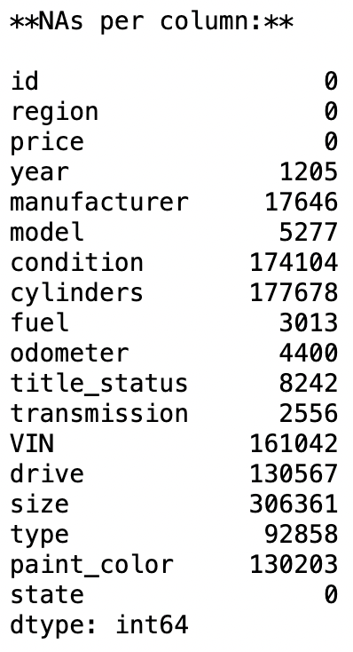

# AI-Dealership-Strategy with CRISP-DM Framework
AI modeling to assist dealership with selling used cars.

##### Description:
We'll be making use of the CRISP-DM Framework to describe and model a business requirement for a used car dealership.

### Business Understanding

From a business perspective, we are tasked with identifying key drivers for used car prices. In the CRISP-DM overview, we are asked to convert this business framing to a data problem definition.

Task reframing: Accurately model the price of used car, given the factors available in the 426 thousand used car prices data set.

The business objective is to find out what the key drivers/factors for used car prices are so that they can adjust their price correctly and make more profitable sales. From a data mining stand point we reframe the task to correctly predict the price of a used car based on our data. If we can train a model that successfully predicts the future price of a car, then we'll have determined what the weights and main factors are that contribute to the modeling. Additionally, we'll be able to establish a certain amount of confidence by testing our models on a training data set using a test-train split.

### Data Understanding

After considering the business understanding, we want to get familiar with our data.

